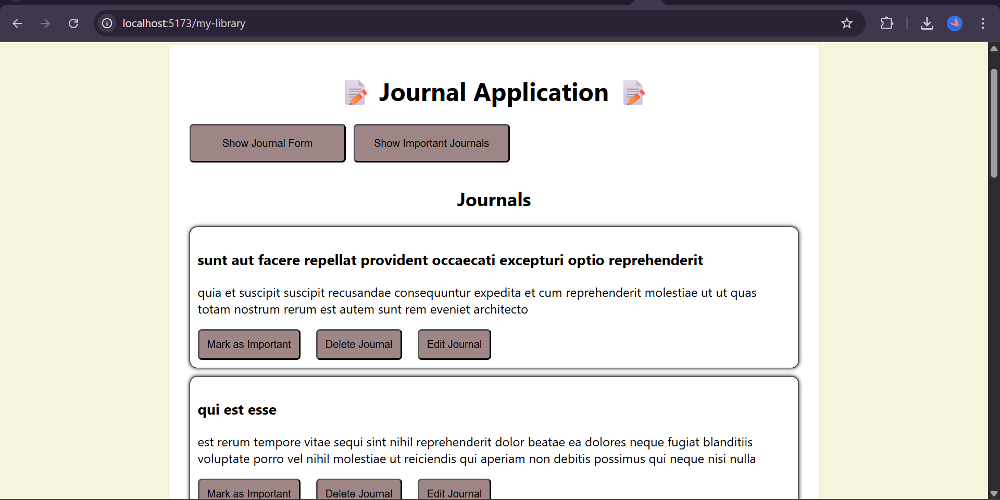
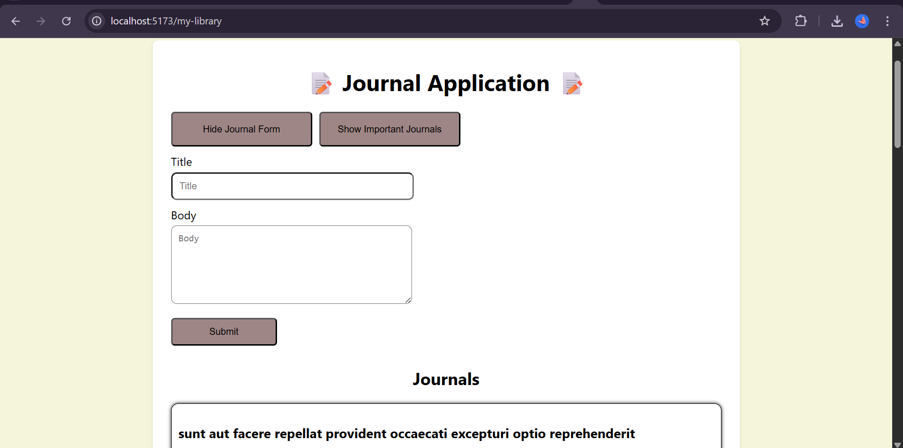
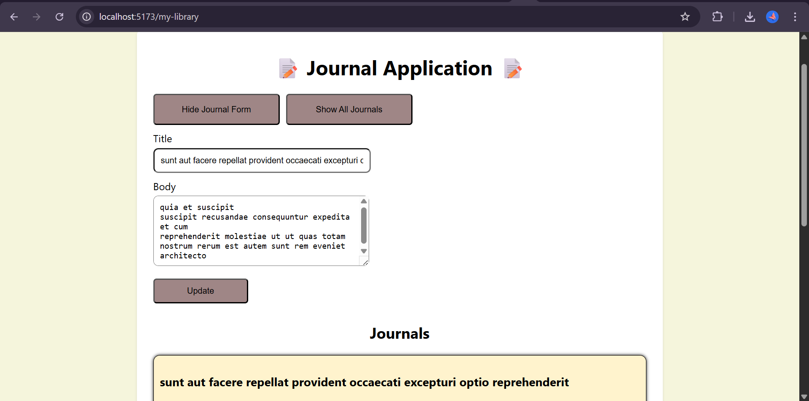
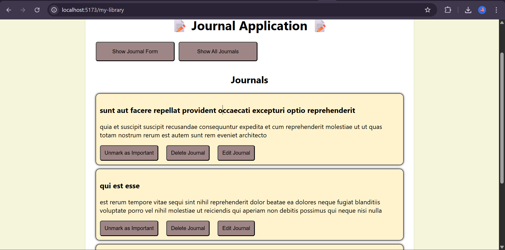

# 📜Journal Application

This is a simple and minimalistic journaling app built with React. Users can create entries, edit or delete what you’ve outgrown, and pin the ones that stick with you. 

## Features

➕ `New Entries` – Write whatever’s on your mind.

✏️ `Edit Mode` – Change your mind? You can update any entry.

❌ `Delete` – Remove what you don’t need.

⭐ `Mark as Important` – Star your favourite thoughts.

🔍 `Filter View` – See everything or just the important stuff.

## Tech Stack

- React
- Vite
- CSS Modules
- JSONPlaceholder (for mock API)

## ⚙️Getting Started

### What you'll need

- [Node.js](https://nodejs.org) (v14+)

- [npm](https://www.npmjs.com)

### Installation

1. Clone the repository:

   ```bash
   git clone git@github.com:Moringa-SDF-PT10/journal-marion-maghanga.git
   ```

2. Navigate to the project folder:

   ```bash
   cd journal-marion-maghanga
   ```

3. Install dependencies:
   ```bash
   npm install
   ```

### Running the app

Start the development server:

```bash
npm run dev
```

Then open http://localhost:5173 in your browser and start writing!

## **Screenshots**

- Default state of the app, with placeholder entries fetched from [JSONPlaceholder](https://jsonplaceholder.typicode.com/posts?_limit=9):

  

- Form for creating journal entries:

  


- Form for editing an existing journal entry:

  

- Filtered journal showing just the important entries:

  


## Contributions 🤝
Contributions are welcome! If you'd like to improve this project:

- Fork the repository

- Create your feature branch: git checkout -b feature/YourFeature

- Commit your changes : git commit -m 'Add some feature'

- Push to the branch: git push origin feature/YourFeature

- Open a Pull Request


### 👩‍💻 Author
**Marion Saru Maghanga**

email : maghangasaru@gmail.com